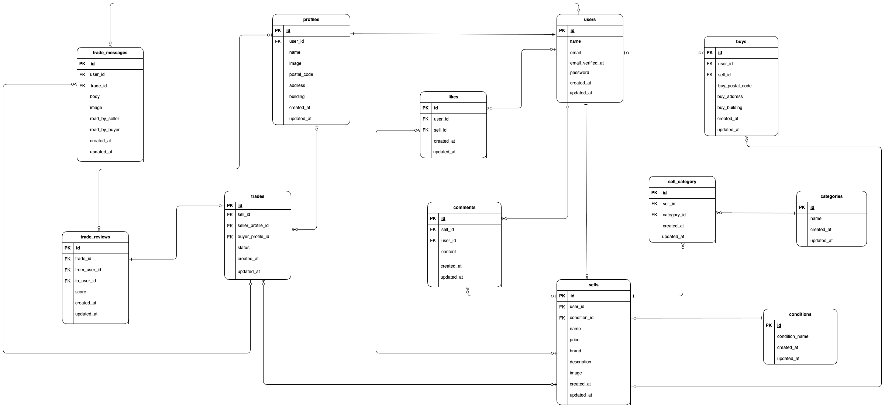

# flea-market

## 環境構築
**Dockerビルド**
1. `git clone https://github.com/matsunagaNatsuki/flea-market.cl.git`
2. DockerDesktopアプリを立ち上げる
3. `docker-compose up -d --build`

> *MacのM1・M2チップのPCの場合、`no matching manifest for linux/arm64/v8 in the manifest list entries`のメッセージが表示されビルドができないことがあります。
エラーが発生する場合は、docker-compose.ymlファイルの「mysql」内に「platform」の項目を追加で記載してください*
``` bash
mysql:
    platform: linux/x86_64(この文追加)
    image: mysql:8.0.26
    environment:
```

**Laravel環境構築**
1. `docker-compose exec php bash`
2. `composer install`

> GitHubのZIPダウンロードがタイムアウトして`git was not found in your PATH, skipping source download`というメッセージが表示され、composer installができない場合があります。
エラーが発生する際は以下コマンドをDockerコンテナ内に入力し、再度`composer install`を行ってください。
```bash
  apt update
  apt install -y git
```

3. 「.env.example」ファイルを「.env」ファイルに命名を変更。または、新しく.envファイルを作成
4. .envに以下の環境変数を追加
```text
DB_CONNECTION=mysql
DB_HOST=mysql
DB_PORT=3306
DB_DATABASE=laravel_db
DB_USERNAME=laravel_user
DB_PASSWORD=laravel_pass
```
5. アプリケーションの作成
```bash
php artisan key:generate
```

6. マイグレーションの実行
```bash
php artisan migrate
```

7. シーディングの実行
```bash
php artisan db:seed
```

8. シンボリックリンク作成
``` bash
php artisan storage:link
```

## ユーザーデータ
  id1: 一般ユーザー1

  email: general1@gmail.com/ password: password

  id2: 一般ユーザー2

  email: general2@gmail.com/ password: password

  id3: 松永 菜月

  email: test@gmail.com/ password: password

## 使用技術（実行環境）
- php8.3.0
- Laravel8.83.27
- MySQL8.0.26

## ER図
  

## URL
- 開発環境 :http://localhost/
- phpMyAdmin: http://localhost:8080/

## 採点者の方へ
このリポジトリについて、補足事項を記載いたします。
これらの項目は事前に運営からの許可を得ています。

1. 12月2日以降のコミットでは、模擬案件提出時に未実装だった箇所を修正しております。
2. リポジトリ名は `flea-market.cl` で、6月13日に提出した模擬案件のデータをコピーして使用しています。
3. 商品購入画面にあるの「取引を開始する」ボタンを押下すると、購入者用の取引チャット画面に入室することができます。
4. 評価シートにて査定された修正箇所を訂正しております。再度ご査定のほどよろしくお願いいたします。


